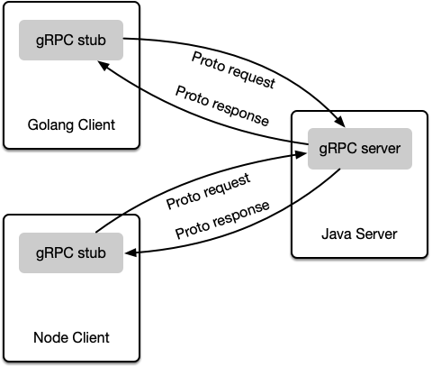

# gRPC theory

My notes from my understanding of how gRPC works in [What is gRPC?](https://grpc.io/docs/guides/) and [gRPC Concepts](https://grpc.io/docs/guides/concepts/).

gRPC can use protocol buffers as both its Interface Definition Language (IDL) and as its underlying message interchange format.

## Overview

In gRPC, a client application can directly call a method on a server application on a different machine as if it were a local object, making it easier for you to create distributed applications and services.

As in many RPC systems, gRPC is based around the idea of **defining a service**, **specifying the methods** that can be called remotely **with their parameters and return types**:

* On the server side, the server implements this interface and runs a gRPC server to handle client calls.
* On the client side, the client has a stub (referred to as just a client in some languages) that provides the same methods as the server

gRPC clients and servers can run and talk to each other in a variety of environments - from servers inside Kubernetes, Istio, AWS to your own desktop - and can be written in any of gRPC’s supported languages. So, for example, you can easily create a gRPC server in Java with clients in Go, Node, or Python.

> In addition, the latest Google APIs will have gRPC versions of their interfaces, letting you easily build Google functionality into your applications.

## Protocol buffers

By default, gRPC uses [Protocol Buffers](https://developers.google.com/protocol-buffers/docs/overview), Google’s mature open source mechanism for serializing structured data (although it can be used with other data formats such as JSON).

 Protocol buffers are a language-neutral, platform-neutral, extensible way of serializing structured data for use in communications protocols, data storage, and more.

### What is it?

Protocol buffers are a flexible, efficient, automated mechanism for serializing structured data – think `XML`, but smaller, faster, and simpler. You define how you want your data to be structured once, then you can use special generated source code to easily write and read your structured data to and from a variety of data streams and **using a variety of languages**.

> You can even update your data structure without breaking deployed programs that are compiled against the "old" format.

### How does it work?

The first step when working with protocol buffers is to define the structure for the data you want to serialize in a **proto file**: _this is an ordinary text file with a `.proto` extension_.

Protocol buffer data is structured as messages, where each message is a small logical record of information containing a series of **name-value pairs** called fields. 

Here’s a simple example:

~~~go
message Person {
  string name = 1;
  int32 id = 2;
  bool has_ponycopter = 3;
}
~~~

Then, once you’ve specified your data structures, you use the protocol buffer compiler protoc to generate data access classes in your preferred language(s) from your proto definition.

These provide simple accessors for each field, like `name()` and `set_name()`, as well as methods to serialize/parse the whole structure to/from raw bytes. So, for instance, if your chosen language is Golang, running the compiler on the example above will generate a `struct` called `Person`. You can then use this `struct` in your application to populate, serialize, and retrieve `Person` protocol buffer messages.

### Where to a specify this?

You define gRPC services in ordinary `proto` files, with RPC method parameters and return types specified as protocol buffer messages:

~~~go
// The greeter service definition.
service Greeter {
  // Sends a greeting
  rpc SayHello (HelloRequest) returns (HelloReply) {}
}

// The request message containing the user's name.
message HelloRequest {
  string name = 1;
}

// The response message containing the greetings
message HelloReply {
  string message = 1;
}
~~~

### How do I convert this in Go code?

gRPC uses `protoc` with a special gRPC plugin to generate code from your proto file: **you get generated gRPC client and server code**, as well as the regular protocol **buffer code for populating, serializing, and retrieving your message types**.

You’ll see an the generated code of the snippet above (including my `SayHelloAgain` extension) [here](./quickstart/helloworld/helloworld/helloworld.pb.go).

### More advanced stuff

A good place to read more is the [Google Developer's Proto Buffer intro](https://developers.google.com/protocol-buffers/docs/overview).

As per the example:

~~~go
message Person {
  required string name = 1;
  required int32 id = 2;
  optional string email = 3;

  enum PhoneType {
    MOBILE = 0;
    HOME = 1;
    WORK = 2;
  }

  message PhoneNumber {
    required string number = 1;
    optional PhoneType type = 2 [default = HOME];
  }

  repeated PhoneNumber phone = 4;
}
~~~

As you can see, the message format is simple.

* Each message type has one or more uniquely numbered fields
* Each field has a name and a value type, where value types can be:
  * numbers (integer or floating-point)
  * booleans,
  * strings,
  * raw bytes,
  * ...or even (as in the example above) other protocol buffer message types, allowing you to structure your data hierarchically.
  
You can specify:

* optional fields
* [required fields](https://developers.google.com/protocol-buffers/docs/proto#required_warning)
* repeated fields

You can add new fields to your message formats without breaking backwards-compatibility; old binaries simply ignore the new field when parsing. So if you have a communications protocol that uses protocol buffers as its data format, you can extend your protocol without having to worry about breaking existing code.

You can find more information about writing `.proto` files in the [Protocol Buffer Language Guide](https://developers.google.com/protocol-buffers/docs/proto).

### Ok, why not just use XML or JSON?

Protocol buffers have many advantages over `XML` and `JSON` for serializing structured data. 

Protocol buffers:

* are simpler
* are 3 to 10 times smaller
* are 20 to 100 times faster
* are less ambiguous
( generate data access classes that are easier to use programmatically

For example, let's say you want to model a person with a name and an email. In XML, you need to do:

~~~xml
<person>
<name>John Doe</name>
<email>jdoe@example.com</email>
</person>
~~~

while the corresponding protocol buffer message (in protocol buffer text format) is:

~~~go
# Textual representation of a protocol buffer.
# This is *not* the binary format used on the wire.
person {
  name: "John Doe"
  email: "jdoe@example.com"
}
~~~

When this message is encoded to the protocol buffer binary format (the text format above is just a convenient human-readable representation for debugging and editing) and you compare this to the XML message, you get:

| Tech | Size | Parsing (nanoseconds) |
|---|--- |---
| Proto buf | 28 bytes | 100-200 |
| XML | 69 bytes | 5,000-10,000 |

### Proto v3

Protocol buffers were initially developed at Google to deal with an index server request/response protocol.

Prior to protocol buffers, there was a format for requests and responses that used hand marshalling/unmarshalling of requests and responses, and that supported a number of versions of the protocol. This resulted in some very ugly code, like:

~~~go
 if (version == 3) {
   ...
 } else if (version > 4) {
   if (version == 5) {
     ...
   }
   ...
 }
 ~~~

Explicitly formatted protocols also complicated the rollout of new protocol versions, because developers had to make sure that all servers between the originator of the request and the actual server handling the request understood the new protocol before they could flip a switch to start using the new protocol.

Protocol buffers were designed to solve many of these problems:

* **New fields could be easily introduced**, and intermediate servers that didn't need to inspect the data could simply parse it and pass through the data without needing to know about all the fields.
* **Formats were more self-describing**, and could be dealt with from a variety of languages (C++, Java, Node, Golang, etc.)

However, users still needed to hand-write their own parsing code.

As the system evolved, it acquired a number of other features and uses:

* **Automatically-generated serialization and deserialization** code avoided the need for hand parsing.
* In addition to being used for short-lived RPC (Remote Procedure Call) requests, people started to **use protocol buffers as a handy self-describing format for storing data persistently** (for example, in Bigtable).
* Server RPC interfaces started to be **declared as part of protocol files**, with the protocol compiler generating stub classes that **users could override with actual implementations** of the server's interface.
